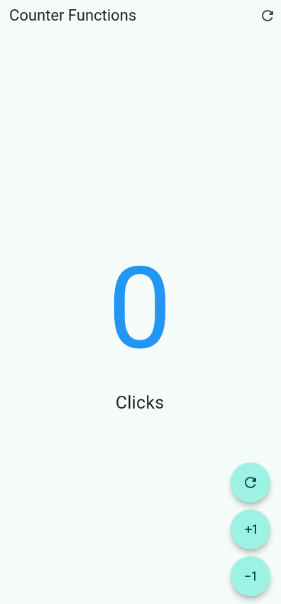
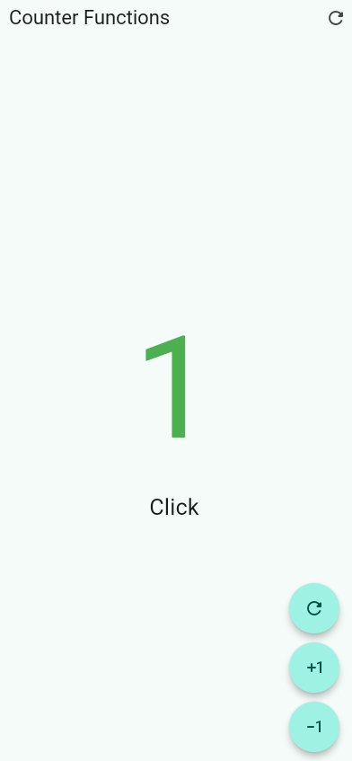
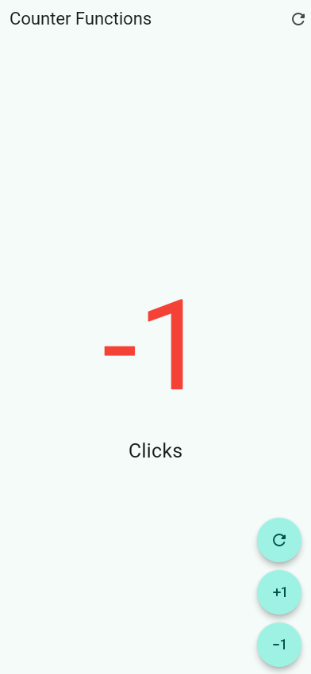
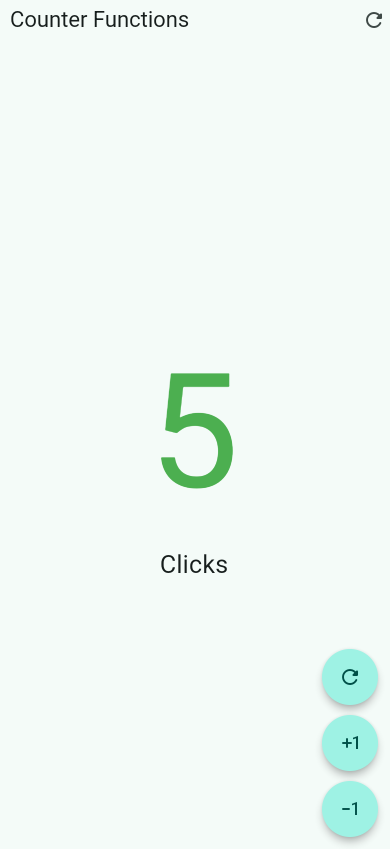

# Práctica No. 2: Mi Primera Aplicación Móvil con Flutter

## Descripción

Desarrollo de una aplicación móvil sencilla utilizando Flutter. La aplicación implementa un contador interactivo que permite aumentar, disminuir y restablecer su valor mediante botones flotantes.

## Actividades realizadas

- Creación de un proyecto móvil con Flutter.
- Implementación de una pantalla con un `StatefulWidget` para administrar el estado del contador.
- Agregado de un botón para incrementar el contador en uno.
- Agregado de un botón para disminuir el contador en uno.
- Agregado de botones para restablecer el contador a cero.
- Aplicación de cambios visuales según el valor del contador: azul en cero, verde en valores positivos y rojo en valores negativos.
- Ajuste del texto entre “Click” y “Clicks” dependiendo del valor mostrado.

## Objetivos

- Conocer la estructura básica de un proyecto Flutter.
- Comprender el uso de widgets con estado.
- Practicar la actualización de la interfaz mediante `setState`.
- Implementar interacción con botones y eventos de usuario.
- Utilizar estilos condicionales para mostrar diferentes estados de la aplicación.

## Resultados

La aplicación funciona como un contador de clics y permite comprobar los siguientes estados:

### Contador en cero

El botón de reinicio establece el contador en `0` y la cantidad se muestra en color azul.

### Contador en uno

Al presionar el botón de incremento una vez, el contador cambia a `1`, se muestra en color verde y el texto cambia a “Click”.

### Contador en menos uno

Al presionar el botón de decremento una vez, el contador cambia a `-1` y se muestra en color rojo.

### Contador en cinco

Al presionar el botón de incremento cinco veces, el contador cambia a `5`, se muestra en color verde y el texto indica “Clicks”.

## Liga

[Arquitectura](https://hesuh05.github.io/Practicas_DMI_230028/practica_02/hello_world_app/architecture/hello_world_app-architecture.html)
