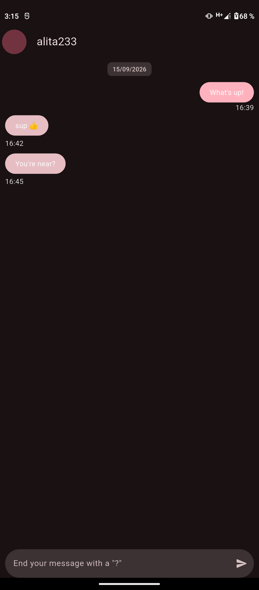
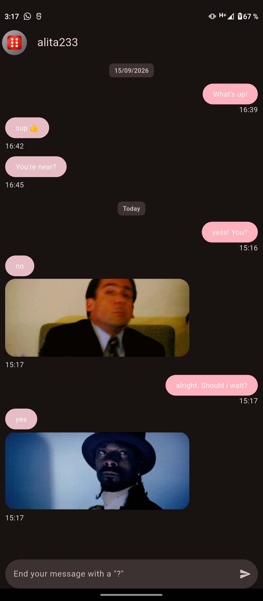
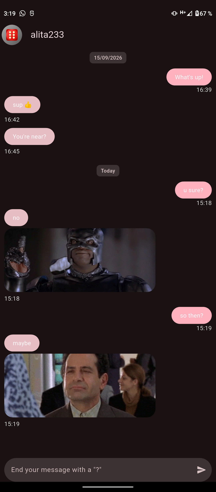

# Práctica No. 3: Aplicación de respuestas Sí o No con Flutter

## Descripción

Desarrollo de una aplicación móvil de chat utilizando Flutter. La aplicación permite escribir preguntas y muestra respuestas de tipo “Sí” o “No” mediante burbujas de conversación e imágenes animadas.

## Actividades realizadas

- Creación de un proyecto móvil con Flutter.
- Implementación de una pantalla de chat para mostrar mensajes del usuario y respuestas.
- Creación de widgets reutilizables para las burbujas de mensajes.
- Agregado de un campo de texto para escribir preguntas.
- Configuración del campo para solicitar que el mensaje termine con `?`.
- Integración de imágenes remotas para representar las respuestas.
- Aplicación de un tema visual personalizado para la interfaz.

## Objetivos

- Practicar la creación de interfaces de chat con Flutter.
- Comprender la composición de widgets y la separación por componentes.
- Implementar campos de texto y acciones de usuario.
- Utilizar imágenes de red dentro de una aplicación móvil.
- Organizar la interfaz mediante widgets reutilizables.

## Resultados

La aplicación presenta una pantalla de conversación en la que el usuario puede escribir preguntas y visualizar respuestas acompañadas de imágenes.

### Vista general del chat

La pantalla principal muestra el encabezado del chat, las burbujas de conversación y el campo para escribir una pregunta.

## Capturas de pantalla

### Vista inicial

**Vista inicial del chat**  
Pantalla principal de la aplicación donde el usuario puede realizar una pregunta y comenzar una conversación.

 

### Respuesta Sí/No

**Respuesta Sí/No**  
La aplicación muestra una respuesta afirmativa o negativa a la pregunta realizada por el usuario.

 

### Respuesta Tal vez

**Respuesta Tal vez**  
La aplicación muestra una respuesta de incertidumbre cuando la opción seleccionada corresponde a **"Tal vez"**.

## Liga

[Arquitectura](https://hesuh05.github.io/Practicas_DMI_230028/practica_03/yes_no_app/architecture/architecture.html)
